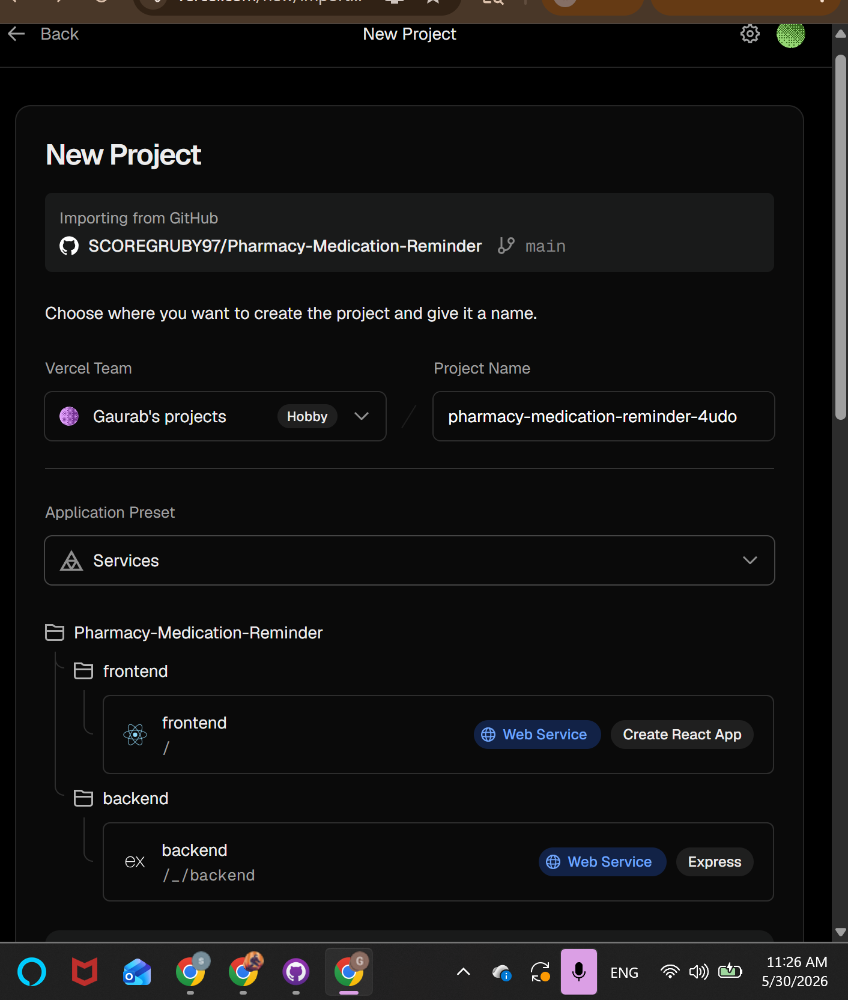

## Week 11 Deliverables

### Deliverable 1: Application Deployment

The Pharmacy Medication Reminder System was prepared for cloud deployment using **Vercel**. The GitHub repository was successfully connected to the hosting platform, allowing the project to be built and deployed directly from the `main` branch.

---

### Deliverable 2: Deployment Configuration

Deployment settings were configured for both frontend and backend services. Environment variables required for database connectivity, authentication, and API communication were prepared for production deployment.

---

### Deliverable 3: CI/CD Setup

Continuous Integration and Continuous Deployment (CI/CD) were established through **GitHub** and **Vercel** integration. This allows automatic builds and deployments whenever updates are pushed to the repository.

---

### Deliverable 4: Deployment Documentation

Documentation was created outlining the deployment process, required configuration settings, environment variables, and deployment workflow.

---

### Deliverable 5: Deployment Evidence

**GitHub Repository:**  
https://github.com/SCOREGRUBY97/Pharmacy-Medication-Reminder

**vercel link:**
https://pharmacy-medication-reminder-e6qo.vercel.app/login

**Deployment Platform:**  
https://vercel.com

**Evidence Screenshot:**

**Figure 1:** Vercel deployment configuration showing the Pharmacy Medication Reminder System repository imported from GitHub and configured for deployment.

---

### Outcome

By the end of Week 11, the project repository was successfully connected to Vercel, deployment settings were configured, CI/CD integration was established, and deployment documentation was completed. This prepared the Pharmacy Medication Reminder System for final deployment and testing.
