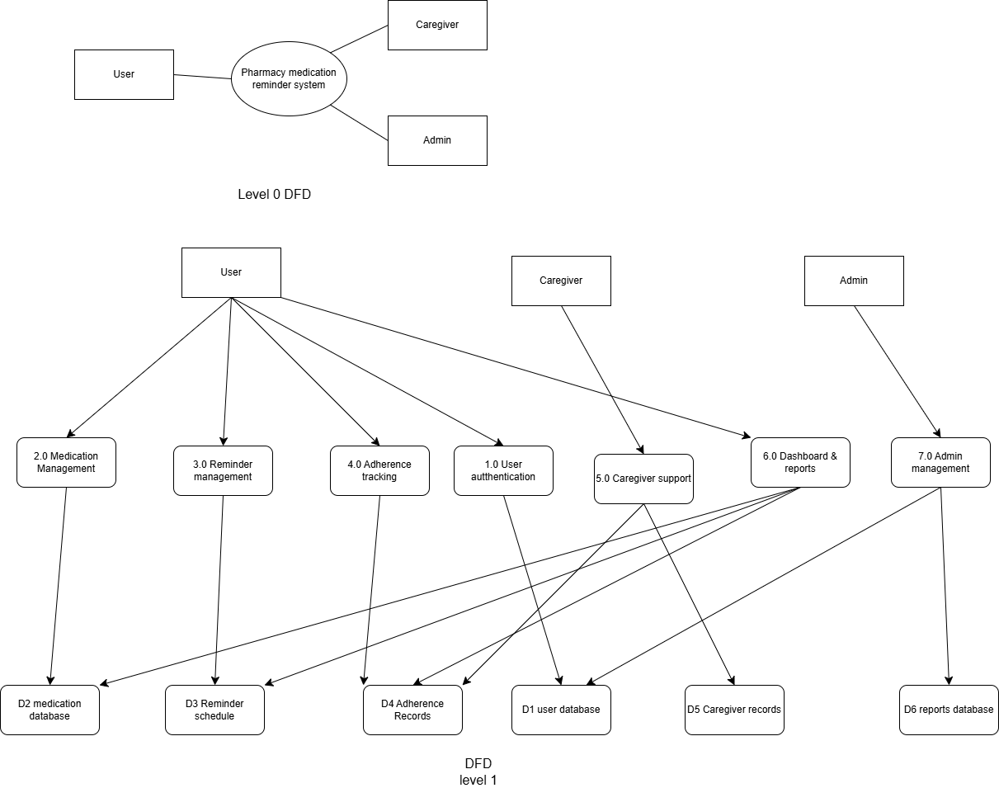

## Week 4 Deliverables

### System Architecture Diagram
The system architecture was designed using a three-tier structure so that the frontend, backend, and database are separated properly. We chose this design because it makes the system easier to manage, scalable, and suitable for handling reminders, schedules, and user data.

### Data Flow Diagram (DFD)
The DFD was included to show how data moves between the user, caregiver, admin, system processes, and databases. We used both Level 0 and Level 1 thinking to explain the overall flow and the detailed internal processes clearly.

### Why We Chose These Designs
- The architecture diagram explains system structure clearly.
- The DFD explains how data moves inside the system.
- Together, both diagrams make the project documentation more complete and professional.
