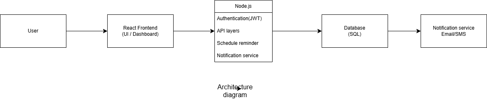
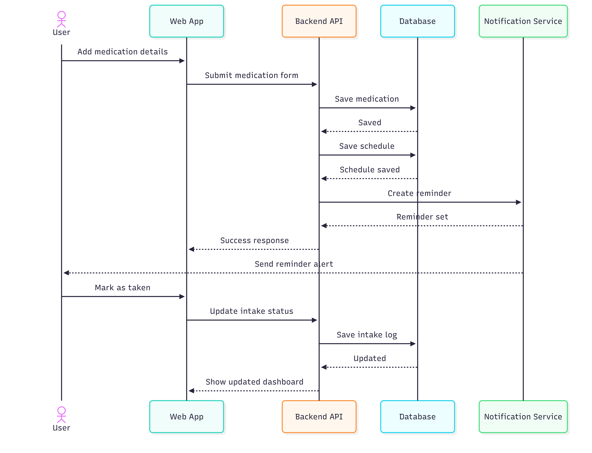

# Week 4 Deliverables

## Overview
For the Pharmacy Medication Reminder System, behavioural diagrams are used to show how the system works from different perspectives. While use case diagrams explain what the system does and who interacts with it, activity, sequence, and state machine diagrams describe how the system behaves internally during those interactions.

These diagrams are important because the system is event-driven. Users add medications, set schedules, and the system automatically generates reminders, records responses, and notifies caregivers when necessary.

---

## Why These Diagrams Are Needed
Each diagram provides a different view of the system:

- Activity Diagram shows the overall workflow and decision points.
- Sequence Diagram shows interactions between system components over time.
- State Machine Diagram shows how a reminder changes its state based on user actions.

---

# 1. Activity Diagram

## Purpose
The activity diagram represents the workflow of the medication reminder process from the user’s perspective.

## Description
The process starts when the user logs into the system. After successful authentication, the user accesses the dashboard, adds medication details, and sets a schedule. Once saved, the system waits until the reminder time is reached.

When triggered, the system sends a notification. The user can either confirm the medication as taken or ignore it. If confirmed, the system updates adherence records. If ignored, the system marks the dose as missed and may notify the caregiver.

## Importance
This diagram helps visualise the overall system workflow and highlights key decision points such as login validation and user response to reminders.

---

# 2. Sequence Diagram

## Purpose
The sequence diagram shows how different components interact during the reminder process.

## Participants
- User  
- Frontend  
- Backend  
- Database  
- Notification Service  

## Description
The interaction begins when the user logs in. The frontend sends credentials to the backend, which verifies them through the database. After login, the user adds medication details, which are stored in the database.

The backend schedules reminders using the notification service. When the scheduled time is reached, the notification is sent to the user. The user then updates the status, and the system records it.

## Importance
This diagram explains the communication between system components and the order of operations in the system.

---

# 3. State Machine Diagram

## Purpose
The state machine diagram represents the lifecycle of a medication reminder.

## Description
A reminder starts in the **Scheduled** state. When the time is reached, it moves to **Reminder Sent**. If the user confirms, it moves to **Taken**. If no response is received, it moves to **Missed**.

After a missed reminder, the system may notify the caregiver. Eventually, all reminders move to the **Completed** state.

## Importance
This diagram helps explain how a reminder changes state based on time and user interaction.

---

# 4. Relation to Use Cases
These diagrams are based on the use cases developed earlier:

- User Login is shown at the start of activity and sequence diagrams.
- Add Medication and Schedule Reminder appear in workflow and interactions.
- Receive Reminder is shown in all diagrams.
- Mark as Taken or Missed is reflected as actions and state changes.
- Notify Caregiver is triggered after missed reminders.

---

# 5. Assumptions
The diagrams are based on the following assumptions:

- Users are already registered before login  
- The system has a working database  
- Reminders are automatically generated  
- Caregiver notifications occur only if linked  
- Notification services may be simulated  

---

# 6. Conclusion
The activity, sequence, and state machine diagrams provide a clear understanding of how the Pharmacy Medication Reminder System behaves. They show workflow, system interactions, and state transitions, helping developers and stakeholders better understand the system design.
