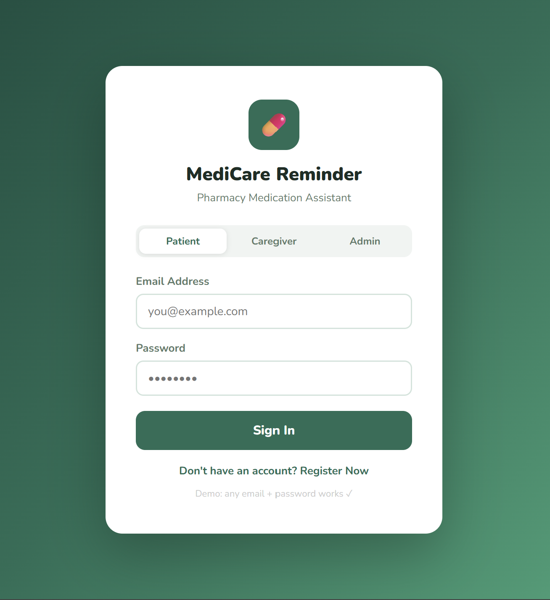
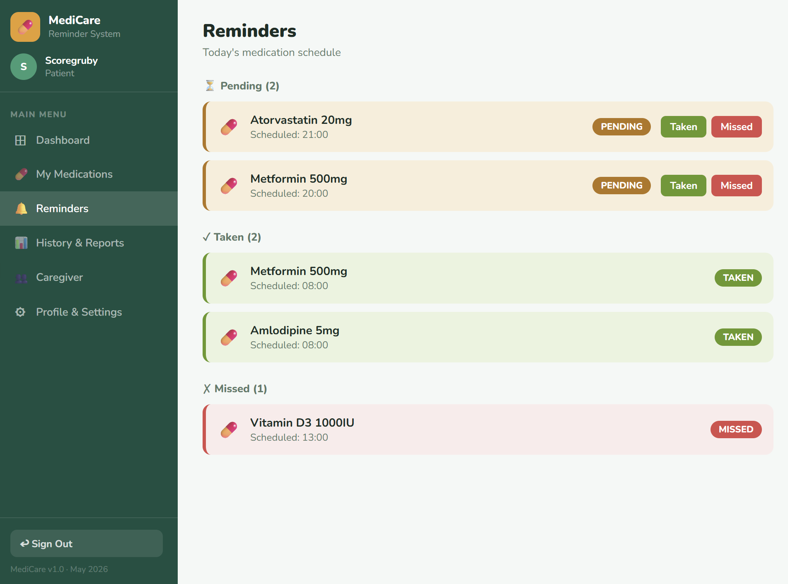
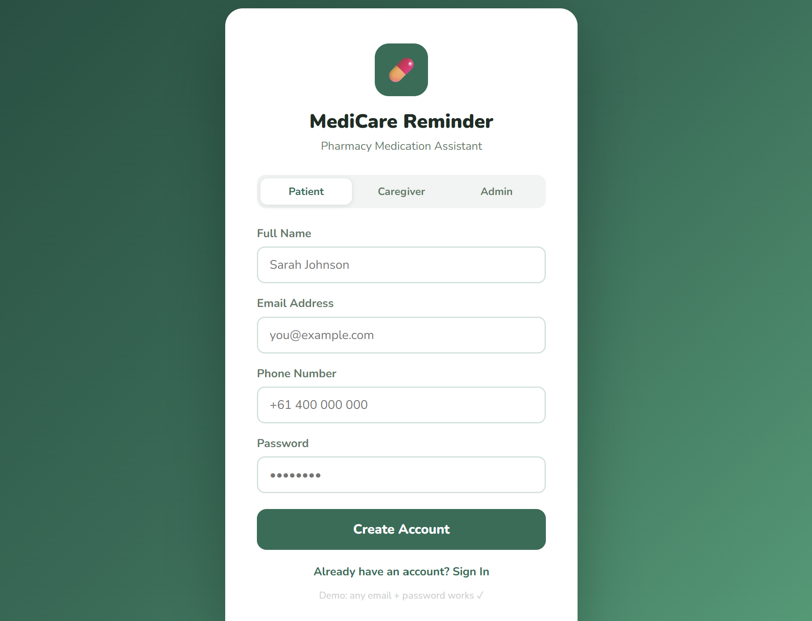
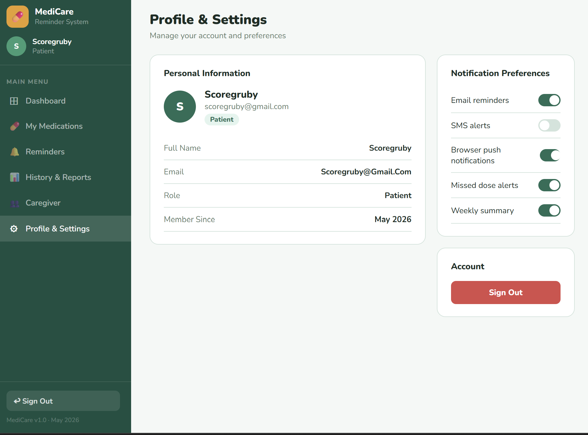

# 💊 Pharmacy Medication Reminder System — UI/UX Design

## Overview
A clear and simple interface designed for elderly and non-technical 
users with readable text, simple buttons, clear navigation, 
and high-contrast colors. Designed in **Figma** before merging 
Frontend and Backend.

---

## 🖥️ Main Screens

### 1. Login / Register Screen
For user, caregiver, and admin authentication.

### 2. User Dashboard
Shows daily medication schedule, upcoming reminders, 
taken/missed status, and adherence summary.

### 3. Add / Edit Medication Screen
Allows users to add medicine name, dosage, frequency, 
start date, end date, and instructions.

### 4. Reminder Setup Screen
Allows users to set reminder time and notification type.

### 5. Adherence History / Reports Screen
Shows taken, missed, and delayed medication records.

### 6. Registration
Allows users to register them.

### 7. Caregiver
Allows caregivers to view patient adherence and missed-dose alerts.

### 8. Profile & Settings
Allows users to manage users, records, and reports. while also allowing them to change reminder.

---

## 🔄 User Navigation Flow
User opens app → Login/Register → Dashboard → Add Medication 
→ Set Reminder → Receive Alert → Mark Taken/Missed 
→ View History/Report
