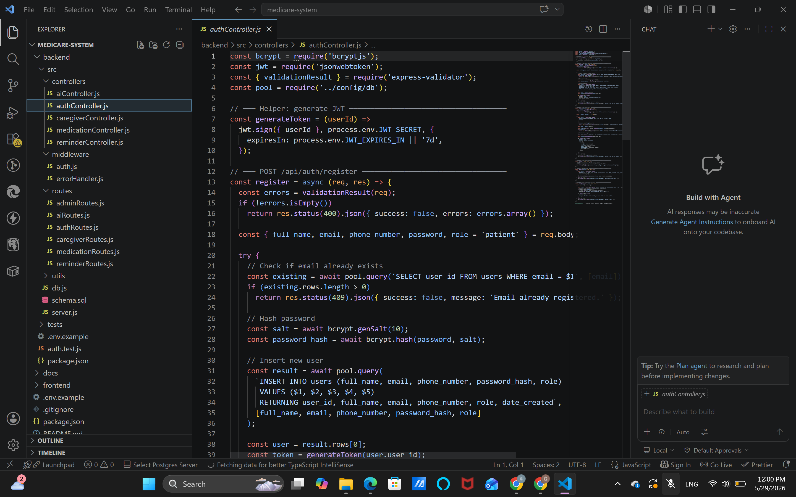
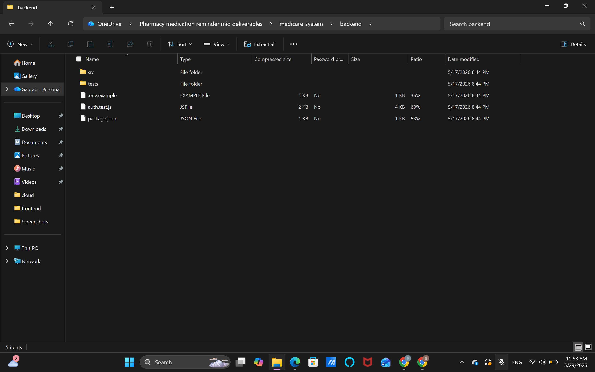

# Week 7 — Backend Development

The objective of Week 7 was to develop the backend services that support the Pharmacy Medication Reminder application. The backend was built using Node.js and Express.js, which provide the server-side functionality and API management. A PostgreSQL database was used to store user accounts, medication records, reminder schedules, caregiver information, and medication history.

The server was configured to handle incoming requests from the frontend application through RESTful APIs. Database connectivity was established using PostgreSQL drivers, allowing data to be stored, retrieved, updated, and deleted securely.

Several API endpoints were implemented, including user registration and login, medication management, reminder scheduling, caregiver support, and report generation. These endpoints allow the frontend to communicate with the database and perform all required operations.

Examples of implemented endpoints include:

| Method | Endpoint | Description |
|--------|----------|-------------|
| POST | `/register` | Create a new user account |
| POST | `/login` | Authenticate users |
| GET | `/medications` | Retrieve medication records |
| POST | `/medications` | Add a new medication |
| PUT | `/medications/:id` | Update medication details |
| DELETE | `/medications/:id` | Remove medication records |
| GET | `/reminders` | Retrieve reminder schedules |
| POST | `/reminders` | Create reminders |

Input validation was implemented to ensure data accuracy and security. Validations include checking required fields, email format validation, password requirements, medication dosage validation, and date/time validation for reminders. Error handling was also added to prevent invalid data from being stored in the database.
By the end of Week 7, the backend services were successfully developed and integrated with the PostgreSQL database. The server was configured, RESTful APIs were implemented, database connectivity was established, and validation mechanisms were added to ensure secure and reliable operation of the Pharmacy Medication Reminder system.

The backend repository is fully functional and supports all core features required by the application.
