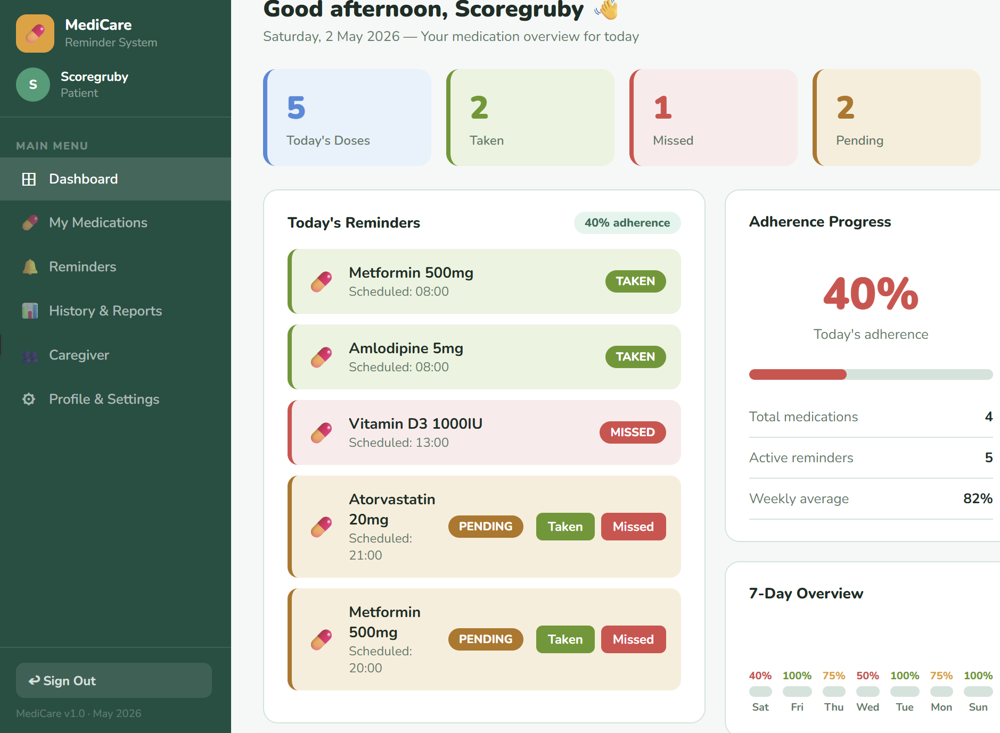
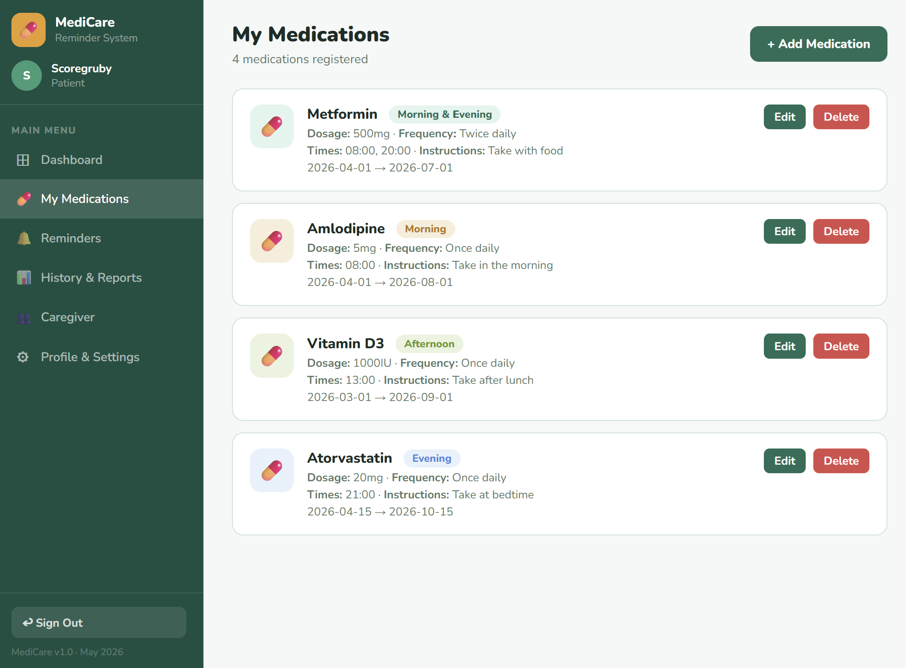
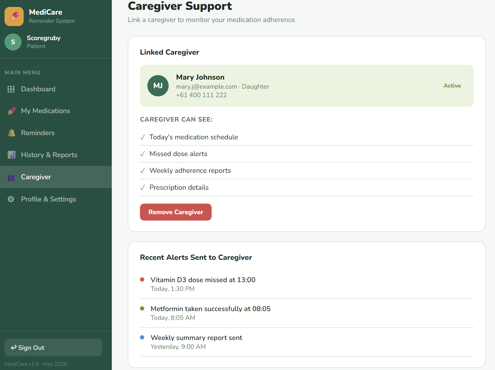

# Week 8 — UI/UX Design and Frontend Development

## Expected Deliverable

Design and implement the user interface for the Pharmacy Medication Reminder system and connect the frontend components with the backend services.

---

## Frontend Development Overview

During Week 8, the frontend development of the Pharmacy Medication Reminder system was completed. The primary objective was to create a user-friendly and responsive interface that allows patients and caregivers to interact with the system efficiently. The frontend was designed with a strong focus on usability, accessibility, and simplicity, ensuring that users of different age groups can easily navigate the application.

The frontend acts as the visual layer of the system and communicates with the backend APIs to display and manage data. The design follows a clean and modern approach with clear navigation menus, readable text, organized layouts, and easy-to-use forms. The implementation ensures that users can quickly access important information such as medication schedules, reminder notifications, adherence progress, and caregiver support features.

---

## User Interface Design

The UI was developed to provide a simple and intuitive experience for users. Each page was designed to support a specific function within the system while maintaining a consistent layout and appearance across the application.

Key design considerations included:

- Clean and modern interface
- Easy navigation between pages
- Responsive layout for different screen sizes
- Readable fonts and clear labels
- Consistent colour scheme and design elements
- User-friendly forms and buttons
- Accessibility-focused design for elderly users

The overall goal was to reduce complexity and make medication management easier for patients and caregivers.

---

## Dashboard Implementation

The Dashboard serves as the main landing page after user login. It provides users with an overview of their medication schedule, reminder status, and overall adherence progress.

Features available on the dashboard include:

- Quick access to medication information
- Daily reminder overview
- Medication adherence tracking
- Summary statistics and notifications
- Easy navigation to other system modules

### Dashboard Evidence

---

## Medication Management Page

The Medication Management page allows users to manage their medications effectively. Through this page, users can add new medications, edit existing records, update dosage information, and remove medications when required.

Features implemented include:

- Add medication functionality
- Edit medication details
- Delete medication records
- View medication schedules
- Display dosage and prescription information

The interface was designed to simplify medication management and minimize user errors when entering information.

### Medication Management Evidence

---

## Caregiver Support Page

The Caregiver Support page enables communication and support between patients and caregivers. This feature allows caregivers to monitor medication adherence and receive important updates regarding patient activities.

Implemented features include:

- Caregiver information display
- Monitoring of medication status
- Alert and notification support
- Patient-caregiver relationship management
- Access to medication activity updates

This functionality improves support for patients who require assistance with medication management.

### Caregiver Support Evidence

---

## Frontend Progress Summary

By the end of Week 8, the frontend implementation was successfully completed. All major user interface pages were developed, tested, and integrated with the backend services. Navigation between screens operates correctly, data is displayed accurately, and user interactions function as expected.

The completed frontend provides a responsive and user-friendly experience while supporting the core objectives of the Pharmacy Medication Reminder system. The dashboard, medication management module, and caregiver support features are fully operational and ready for system integration and final testing.
